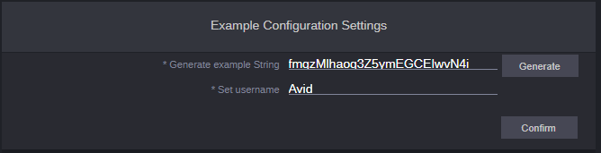
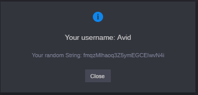

# Configuration Settings Example

This example, Give you new option for Admin View in Configuration Settings

**Everything in this example is mocked so you won't break anything in your CloudUX.**

## Prerequisites
To run this application you will need following things:
1. running **MediaCentral | Cloud UX 2018.6** machine
2. [node.js and npm](https://nodejs.org)

For more information **Check our [Quick Start](http://developer.avid.com/quickStart.html) for CloudUX**

## Example
To see example, you need to login to **admin view**:

At top click on the **wrench** icon to see configuration settings:

You should be able to see Example configuration setting:

In this settings fill all the information and press Create Account:

If everything is correct you will see this box:

## Running the example

To run example you will need Avid MediaCentral | Cloud UX server. Properties
can we changed in [src/project.config.json](srcproject.config.json "Project act").
After you change hostIp in `project.config.json` you can run application.

**from cli type:**
1. `npm install`
2. `npm start`
3. Go to your [https://127.0.0.1:8080/admin-login](https://127.0.0.1:8080/admin-login "127.0.0.1:8080")
